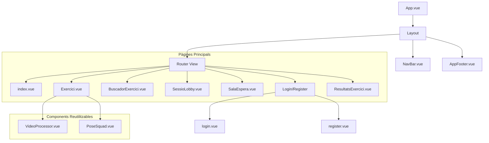
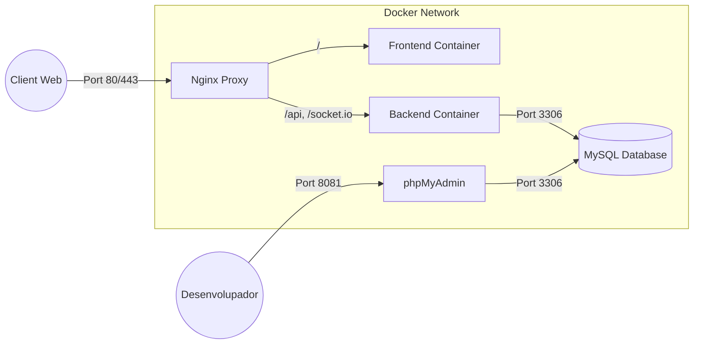

# 🧠 **FitCam**


---

## 👥 **Membres de l’equip**
- **Eduard Vilaseca**  
- **Aymar Ramos**  
- **Biel Calvet**  
- **Fabrizzio Rodríguez**

---

FitCam és una aplicació web interactiva que utilitza visió per computador per gamificar l'exercici físic. Els usuaris poden competir en temps real realitzant exercicis que són detectats i validats a través de la càmera del seu dispositiu.

## 🏗️ Arquitectura del Sistema

El projecte segueix una arquitectura de microserveis contenidoritzada, separant clarament el frontend, el backend i la base de dades.

- **Frontend**: Desenvolupat amb **Vue 3** i **Vite**, utilitzant **Vuetify** per a la interfície d'usuari. S'encarrega de la interacció amb l'usuari i el processament de vídeo en el client (Edge AI) per a la detecció de postures.
- **Backend**: Construït amb **Node.js** i **Express**. Gestiona l'autenticació (JWT), la lògica de negoci i la comunicació en temps real mitjançant **Socket.io**.
- **Base de Dades**: **MySQL** per a la persistència de dades (usuaris, exercicis, resultats).
- **Infraestructura**: Orquestrat amb **Docker Compose**, incloent un proxy invers **Nginx** per gestionar el trànsit.

## 🧩 Diagrama de Components (Frontend)

A continuació es mostra l'estructura principal de components i pàgines de l'aplicació Vue:



## 🐳 Diagrama d'Infraestructura Docker

El sistema es desplega mitjançant 5 contenidors interconnectats:



## 🚀 Guia de Desplegament

### Prerequisits
- [Docker](https://www.docker.com/get-started) instal·lat i en execució.
- [Git](https://git-scm.com/) per clonar el repositori.

### Passos per Desplegar

1. **Clonar el repositori**:
   ```bash
   git clone <url-del-repositori>
   cd tr1-type-racer-royale-dam_25_26_tr1g5-1
   ```

2. **Configurar variables d'entorn**:
   Assegura't de tenir l'arxiu `.env` a l'arrel (o utilitza els valors per defecte configurats a `docker-compose.yml`).

3. **Construir i aixecar els contenidors**:
   ```bash
   docker compose up --build
   ```
   Aquesta comanda descarregarà les imatges necessàries, construirà el frontend i el backend, i iniciarà tots els serveis.

4. **Accedir a l'aplicació**:
   - **Web App**: Obre el teu navegador a `http://localhost`
   - **phpMyAdmin**: Per gestionar la BD, accedeix a `http://localhost:8081`

### Comandes Útils

- **Aturar els serveis**:
  ```bash
  docker compose down -v
  ```

## 🧾 **Llicència**
Projecte acadèmic desenvolupat dins del mòdul de **Projectes Transversals - 2n DAM (Institut Pedralbes)**.  
No destinat a ús comercial.
